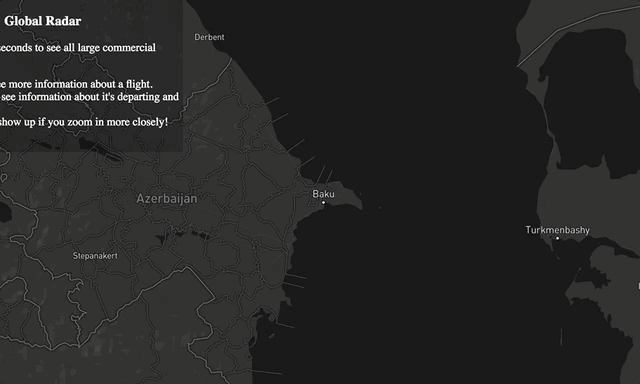

# Global-Radar-Final

[Live Site](https://global-radar-final.herokuapp.com/)

Global Radar shows live flight information of commercial airlines of the following aircrafts. 
- A333
- A343
- A346
- A359
- A388
- B772
- B773
- B744
- B748

__Flights__

Users can click on all the airplanes on the map and see where it departed from and arriving to. 
It will also display flight number, speed, aircraft, and altitude.

Yellow solid line indicates the airport where flight left from. Dashed line tells the user where it will be arriving.

__Airports__

By default, there's about 30+ major airports on the map. However, when users zoom in an area, they can view smaller airports 
in that region. 

When a user clicks on an airport, several lines can be displayed on the map. Solid lines connect to the flights that have departed from the airport. Dashed lines show the flights that will be arriving.

